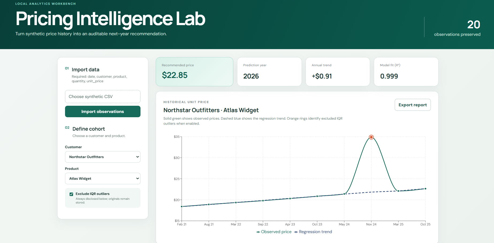

# Pricing Intelligence Lab

Pricing Intelligence Lab turns synthetic transaction history into an auditable next-year price recommendation. It gives pricing teams a transparent workflow for exploring customer-product trends, comparing optional outlier treatment, and understanding the model behind a recommendation.

**[Open the live demo](https://pricing-intelligence-lab-production.up.railway.app)**

> **Public portfolio demo using entirely fictional data. Data uploads are disabled.**

## Application preview



*The dashboard shows the synthetic Northstar Outfitters and Atlas Widget example.*

## Hosted public demo

> **Public portfolio demo using entirely fictional data. Data uploads are disabled.**

The hosted Railway application uses the included fictional sample dataset. When `NODE_ENV=production` and `ALLOW_IMPORTS=false`, the server:

- seeds `sample-data/SYNTHETIC_SAMPLE_pricing_history.csv` only when the SQLite database is empty;
- never replaces existing persistent data during a restart or redeployment;
- returns HTTP 403 for the import endpoint;
- hides CSV upload controls in the interface; and
- preserves filtering, aggregate exploration, cohort recommendations, IQR comparison, charts, rationale, and fictional report export.

## Try the demo

1. Open the [live Pricing Intelligence Lab](https://pricing-intelligence-lab-production.up.railway.app).
2. Select **Northstar Outfitters** as the customer.
3. Select **Atlas Widget** as the product.
4. Enable **Exclude IQR outliers**.
5. Observe the auditable next-year recommendation of **$22.85**, along with the fitted regression trend and the explicitly identified excluded observation.

## Features

- Filters analysis by fictional customer and product.
- Preserves aggregate selections for observed-price exploration without combining unrelated cohorts into one regression.
- Fits ordinary least-squares regression only after one specific customer and product are selected.
- Optionally identifies outliers with the 1.5×IQR rule and explicitly lists every excluded source row.
- Explains slope, intercept, fitted sample size, prediction, and R² in plain language.
- Exports a standalone fictional HTML recommendation report.
- Provides clear empty, loading, success, validation-error, and server-error states.
- Supports validated, transactional CSV replacement during local development.

## Fictional data notice

All customer names, product names, prices, quantities, and transaction records included in this repository are entirely fictional and were created solely for demonstration. The project contains no proprietary, confidential, or real customer data.

The included dataset is `sample-data/SYNTHETIC_SAMPLE_pricing_history.csv`.

## Technology stack

- **Frontend:** React 19, TypeScript, Vite, Recharts
- **Backend:** Node.js 24, Express, TypeScript
- **Persistence:** SQLite through Node's built-in `node:sqlite` module
- **Validation and import:** Zod, csv-parse, Multer
- **Security:** Helmet, same-origin production delivery, targeted API rate limits
- **Testing:** Vitest, Supertest
- **Automation:** GitHub Actions

## Local development

Requirements: Node.js 24 LTS and npm.

```powershell
npm install
npm run dev
```

Open `http://localhost:5173`. Local development enables CSV importing by default. Importing a valid CSV transactionally replaces the fictional dataset in that user's local SQLite database; validation failures leave the previous valid dataset intact.

Local import mode must not be deployed as an import-enabled shared public service. Local imports should not be used for sensitive, confidential, personal, proprietary, or regulated data without an independent security and legal review. Running the project locally is not, by itself, a guarantee of privacy or security.

Copy `.env.example` to `.env` to override local settings. Never commit `.env`.

## CSV format and validation

Headers must be exactly:

```text
date,customer,product,quantity,unit_price
```

Dates must be real calendar dates in `YYYY-MM-DD` format. Customer and product names are limited to 100 characters. Quantity and unit price must be positive, finite values no greater than 1,000,000,000. Imports are limited to 10,000 rows and 2 MB. Invalid imports return clear HTTP 400, 413, or 422 responses without logging uploaded CSV contents.

## Architecture

The production build is a single same-origin Node service:

```text
Browser
  └── Express
      ├── /api/*       JSON API
      ├── /assets/*    Vite production assets
      ├── /*            SPA fallback
      └── SQLite        persistent-volume path
```

- `src/`: React interface, visualization, report export, and user-facing states.
- `server/`: Express API, production static serving, CSV validation, seeding, and SQLite lifecycle.
- `shared/`: framework-independent types, eligibility, IQR detection, and regression.
- `sample-data/`: clearly labeled fictional data.

## Calculation methodology

Linear regression uses ordinary least squares with decimal year as `x` and unit price as `y`. The recommendation evaluates the fitted line at the calendar year after the latest observation. A recommendation is available only for a specific customer-product cohort.

Optional outliers use Tukey's rule: prices below `Q1 − 1.5 × IQR` or above `Q3 + 1.5 × IQR` are flagged. Exclusion is off by default. When enabled, every excluded observation is highlighted and listed with its original CSV row number. Stored observations remain unchanged.

## Production build and runtime

```powershell
npm ci
npm run build
npm start
```

`npm run build` first removes stale `dist/` and `dist-server/` output, then compiles the API and Vite frontend. `npm start` serves the compiled API and frontend from one process.

Required runtime configuration:

| Variable | Public-demo value | Purpose |
|---|---|---|
| `NODE_ENV` | `production` | Enables production behavior and asset caching. |
| `ALLOW_IMPORTS` | `false` | Disables every import endpoint and upload control. |
| `PORT` | Platform-provided | HTTP listening port; defaults to `3001`. |
| `DATABASE_PATH` | Persistent-volume file path | Absolute or relative writable SQLite path. |

Health-check endpoint: `GET /api/health` returns HTTP 200 with `{"status":"ok"}`.

## Deployment

The public portfolio demo is deployed on Railway from the `main` branch. Railway automatically deploys new commits pushed to `main`.

- Platform: Railway
- Architecture: one Node service with exactly one application instance
- Persistence: one attached SQLite volume mounted at `/app/data`
- Database path: `/app/data/pricing-lab.db`
- Build command: `npm run build` (Railway installs dependencies before this step)
- Start command: `npm start`
- Health check: [`/api/health`](https://pricing-intelligence-lab-production.up.railway.app/api/health)
- Deployment source: automatic deployments from `main`

SQLite requires the service to remain at one application instance because this design does not support concurrent replicas sharing a single database file. The attached persistent volume preserves the fictional dataset across application restarts and redeployments.

## Testing

```powershell
npm test
npm run build
```

Tests cover calculations, eligibility, CSV safety limits, transactional replacement, rollback preservation, production import blocking, empty-only fictional seeding, restart persistence, static asset serving, JSON API 404s, health checks, aggregate exploration, and cohort recommendations.

GitHub Actions runs `npm ci`, `npm test`, and `npm run build` on pushes and pull requests to `main`.

## Limitations and future improvements

- The MVP supports one active dataset rather than multiple named datasets or organizations.
- Recommendations do not yet incorporate cost, seasonality, elasticity, or competitive signals.
- SQLite requires a single application instance and persistent storage.
- Public production imports are intentionally unavailable; a multi-user import service would require authentication, authorization, isolated datasets, and a managed database.
- Report export is standalone HTML rather than a branded PDF or hosted report.
- Future work could add confidence intervals, scenario analysis, richer diagnostics, accessible data-table views, and managed-database support.

## Repository safety

Generated databases, reports, secrets, dependency folders, build output, logs, and coverage are excluded through `.gitignore`.
